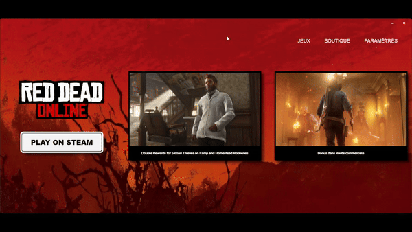

# RedM Launcher

## Description
Ce projet est un launcher pour RedM (Red Dead Redemption 2 Multiplayer) développé avec Wails et Go. Il permet de se connecter à différents serveurs en modifiant simplement l'adresse du serveur dans le code.

## Fonctionnalités
- Connexion à un serveur RedM spécifié
- Gestion des erreurs lors du lancement de RedM
- Facilité de modification de l'adresse du serveur pour se connecter à différents serveurs

## Installation

1. Clonez ce dépôt sur votre machine locale :
```bash
git clone https://github.com/votre-utilisateur/votre-depot.git
```

2. Accédez au répertoire du projet :
```bash
cd vRedMLauncher
```

3. Assurez-vous d'avoir Go installé sur votre machine. Si ce n'est pas le cas, téléchargez-le et installez-le depuis [golang.org](https://golang.org)

4. Installez Wails :
```bash
go install github.com/wailsapp/wails/v2/cmd/wails@latest
```

## Utilisation

1. Ouvrez le fichier source du projet `main.go`
2. Modifiez l'adresse du serveur dans le code suivant pour vous connecter à votre serveur préféré :

```go
fmt.Println("Tentative de connexion à Lawless...")
cmd = exec.Command(redMExePath, "+connect", "rdr.lawless-street.fr")
err = cmd.Start()
if err != nil {
    fmt.Println("Erreur lors du lancement de RedM.exe:", err)
    return
}
```

3. Remplacez "rdr.lawless-street.fr" par l'adresse de votre serveur

4. Compilez et exécutez le programme avec Wails :
```bash
wails build
./build/vRedMLauncher
```

## Contribution
Les contributions sont les bienvenues ! Si vous avez des suggestions, des améliorations ou des corrections, n'hésitez pas à ouvrir une issue ou à soumettre une pull request.

## Licence
Ce projet est sous licence MIT. Voir le fichier LICENSE pour plus de détails.

## Contact
Pour toute question ou support, rejoignez notre serveur [Discord](Discord)

---

Merci d'utiliser ce launcher RedM ! N'hésitez pas à partager vos retours et suggestions.
